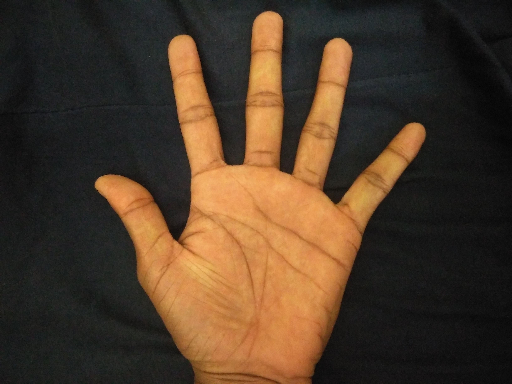

###Recognise person by his hand shape and geometry
#####obtain hand image

#####get binary image

#####Get contour with centroid

#####Extract convex hull of contour

#####Extract valleys by convexity defects

#####Extract peaks as intersection of convex hull and cotour above centroid

#####Extract knuckles as midpoint between valleys

#####Obtain seven lines as shown below

#####Normalize them and store as feature vecor

