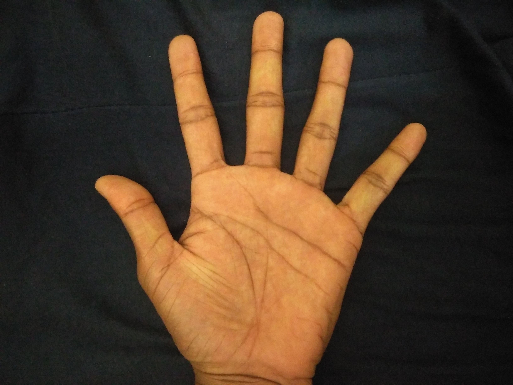
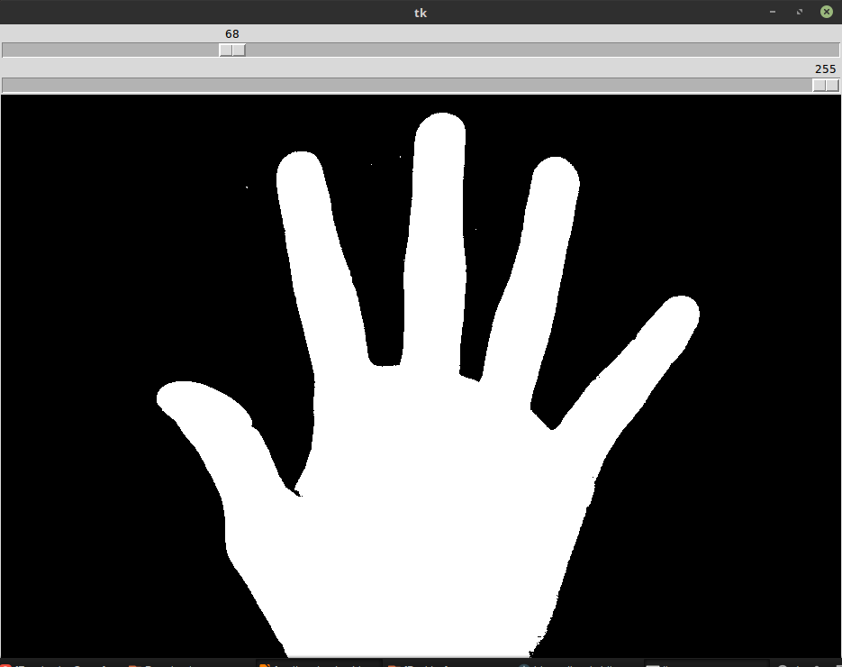
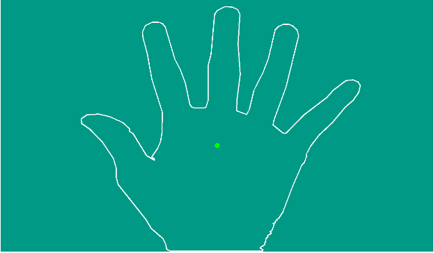
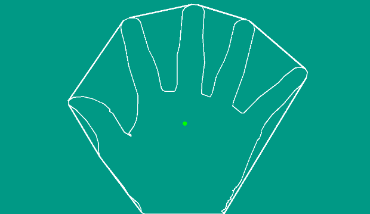
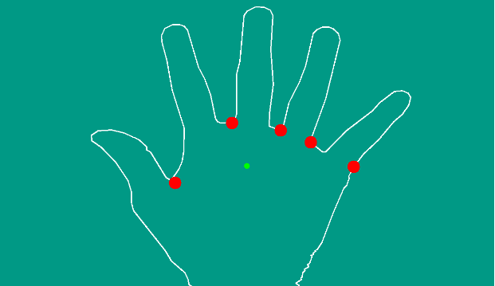
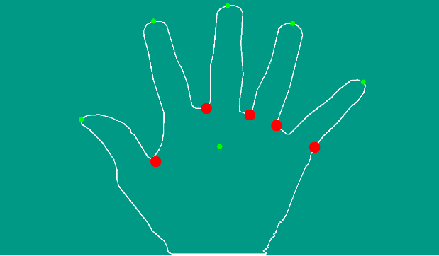
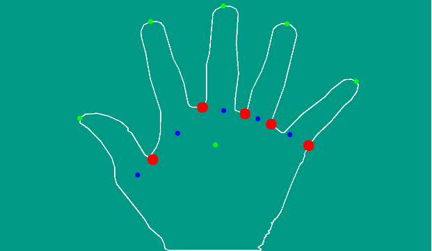
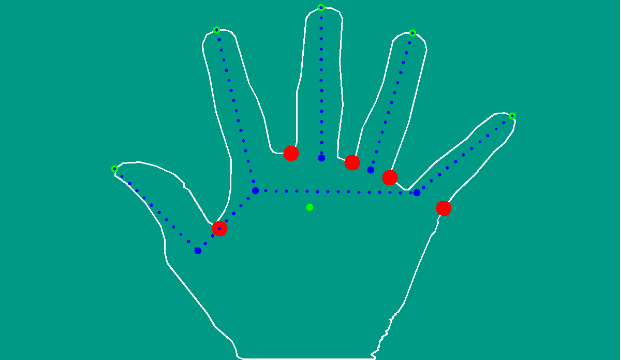

### Recognise person by his hand shape and geometry ###
#####obtain hand image#####

##### get binary image#####

##### Get contour with centroid#####

##### Extract convex hull of contour#####

##### Extract valleys by convexity defects#####

##### Extract peaks as intersection of convex hull and cotour above centroid#####

##### Extract knuckles as midpoint between valleys#####

##### Obtain seven lines as shown below#####

##### Normalize them and store as feature vecor#####

